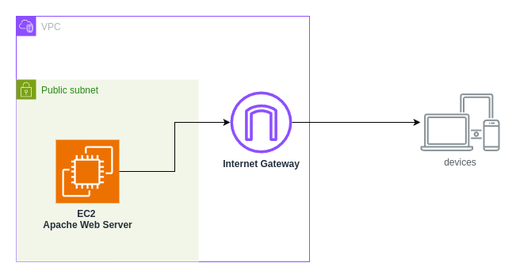

# Terraform Architectural Practices

**Table Of Contents**
- [Simple Web Server v1](#version-1)
- [Version 2](#version-2)

## Version 1 - Simple Web Server

This version of the project is towards purely understanding the basics of Terraform and implementing a simple web page that is hosted on Apache Web Server

The security group for the EC2 instance that is located in a public subnet allows inbound access to its 80 and 443 numbered ports for HTTP/HTTPS access and outbound access from all of its ports. 

## Version 2